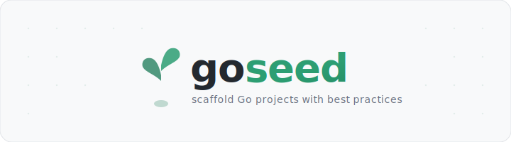
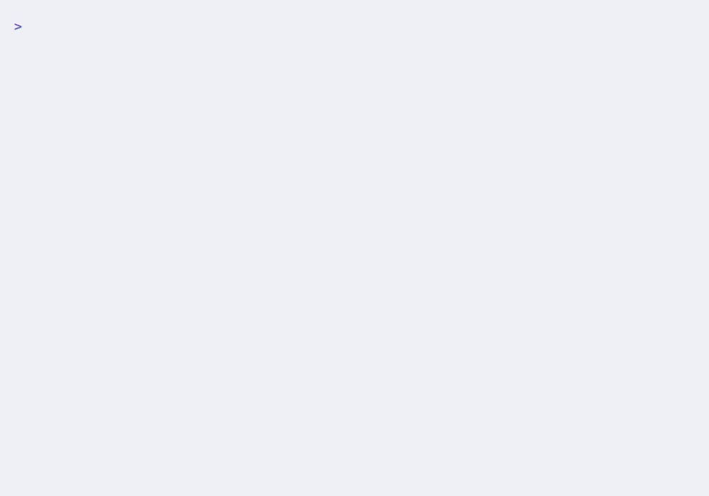

<picture>
  <source media="(prefers-color-scheme: dark)" srcset="goseed-dark.svg">
  <source media="(prefers-color-scheme: light)" srcset="goseed-light.svg">
  
</picture>

[](https://github.com/zulerne/goseed/actions/workflows/ci.yml)
[](https://go.dev)
[](https://goreportcard.com/report/github.com/zulerne/goseed)
[](https://codecov.io/gh/zulerne/goseed)
[](https://pkg.go.dev/github.com/zulerne/goseed)
[](https://github.com/zulerne/goseed/releases)

Interactive CLI tool that scaffolds Go projects with a clean foundation — CI, linting, Claude Code integration, and more.

<picture>
  <source media="(prefers-color-scheme: dark)" srcset="demo-dark.gif">
  <source media="(prefers-color-scheme: light)" srcset="demo-light.gif">
  
</picture>

## Install

```bash
brew install zulerne/tap/goseed
```

Or build from source:

```bash
go install github.com/zulerne/goseed/cmd/goseed@latest
```

## Usage

### Interactive mode

```bash
goseed
```

Walks you through 4 screens (project identity, license & build tool, features, automation) and generates a ready-to-build project.

### Non-interactive mode

```bash
goseed --name myapp --module github.com/user/myapp --no-interactive
```

### Flags

| Flag | Default | Description |
|---|---|---|
| `--name` | | Project name |
| `--module` | | Go module path |
| `--go-version` | `1.26` | Go version |
| `--license` | `MIT` | `MIT`, `Apache-2.0`, or `none` |
| `--build-tool` | `taskfile` | `taskfile`, `makefile`, or `none` |
| `--linter` | `true` | Include golangci-lint config |
| `--goreleaser` | `false` | Include GoReleaser |
| `--docker` | `false` | Include Dockerfile |
| `--env-example` | `true` | Include .env.example |
| `--dependabot` | `false` | Include Dependabot config |
| `--claude` | `false` | Include Claude Code files |
| `--claude-ci` | `false` | Include Claude CI workflows |
| `--no-interactive` | `false` | Skip TUI, use flags + defaults |
| `--output-dir` | `.` | Output directory |

## What's Generated

Every project includes:
- `cmd/{name}/main.go`, `internal/`
- `.gitignore`, `.editorconfig`
- `go.mod`, `README.md`
- GitHub issue & PR templates

Optional (based on choices):
- `.golangci.yml` — 17+ linters
- `Taskfile.yml` or `Makefile`
- `.goreleaser.yaml` + release workflow
- `Dockerfile` + `.dockerignore`
- `.env.example`
- `.github/dependabot.yml`
- CI workflow (test + lint + govulncheck)
- Dependency review workflow
- `CLAUDE.md` + `.claude/rules/go.md`
- Claude Code CI workflows
- `LICENSE` (MIT or Apache 2.0)

## Contributing

See [CONTRIBUTING.md](CONTRIBUTING.md) for development setup and guidelines.

## License

[MIT](LICENSE)
